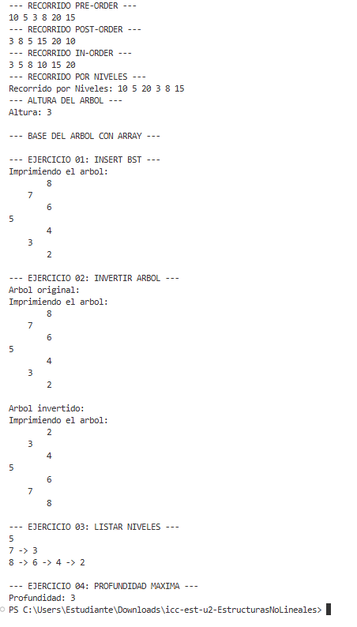

# Estructuras de Datos – Ejercicios con Árboles Binarios

## Estudiante:
Sebastian Arenillas

## Asignatura:
Estructura de Datos – Segundo Interciclo

## Práctica:
Práctica 4 – Árboles Binarios y Árboles Binarios de Búsqueda (BST)

---

# Objetivo de la práctica

- Mejorar la comprensión de estructuras de datos no lineales.
- Aplicar árboles binarios y árboles binarios de búsqueda (BST).
- Implementar algoritmos de inserción, inversión, recorrido por niveles y cálculo de profundidad.
- Organizar el código en clases y métodos reutilizables.

---

# Descripción del proyecto

Este proyecto implementa operaciones fundamentales sobre árboles binarios:

- Inserción en un Árbol Binario de Búsqueda (BST)
- Inversión de un árbol binario
- Recorrido y visualización de niveles
- Cálculo de la profundidad máxima del árbol

Se utiliza Java con estructuras recursivas para resolver los ejercicios.

---

# Estructura del proyecto


src/
├── models/
│ └── Person.java
├── structures/
│ └── node/
│ └── Node.java
├── trees/
│ ├── IntTree.java
│ ├── BinaryTree.java
│ ├── InsertBSTTest.java
│ ├── Ejercicio1.java
│ ├── Ejercicio2.java
│ ├── Ejercicio3.java
│ └── Ejercicio4.java
└── App.java


---

# Ejercicio 01: Insertar en BST

## Clase: InsertBSTTest

## Método:
```java
Node insert(int[] numeros)
Lógica:

Se recorre el arreglo y cada valor se inserta en un árbol binario de búsqueda (BST) respetando:

Menores a la izquierda
Mayores a la derecha
Entrada:
int[] numeros = {5, 3, 7, 2, 4, 6, 8};
Salida esperada:

Árbol BST correctamente construido.

Ejercicio 02: Invertir Árbol Binario
Clase: Ejercicio2
Método:
Node invert(Node root)
Lógica:

Se intercambian recursivamente los hijos izquierdo y derecho de cada nodo.

Resultado:

El árbol queda reflejado horizontalmente.

Ejercicio 03: Listar niveles
Clase: Ejercicio3
Método:
List<List<Node>> listLevels(Node root)
Lógica:

Se recorre el árbol por niveles usando una cola (BFS) y se agrupan los nodos por nivel.

Ejemplo de salida:
5
3 -> 7
2 -> 4 -> 6 -> 8
Ejercicio 04: Profundidad máxima
Clase: Ejercicio4
Método:
int maxDepth(Node root)
Lógica:

Se calcula recursivamente la altura del árbol comparando:

Subárbol izquierdo
Subárbol derecho
Resultado:

Profundidad máxima del árbol.

Ejecución del programa

La ejecución se realiza desde la clase:

App.java
Flujo principal:
Se construye un árbol BST con:
int[] numeros = {5, 3, 7, 2, 4, 6, 8};
Se ejecutan los ejercicios:
Inserción BST
Inversión del árbol
Listado por niveles
Cálculo de profundidad
Evidencias de ejecución
Ejercicio 01 – Insert BST

Se genera correctamente el árbol BST desde un arreglo.

Ejercicio 02 – Invertir árbol

Se muestra el árbol original y el árbol invertido.

Ejercicio 03 – Listar niveles

Se imprimen los nodos agrupados por niveles.

Ejercicio 04 – Profundidad máxima

Se calcula la altura total del árbol.



Conclusiones
Los árboles binarios permiten representar estructuras jerárquicas de forma eficiente.
El BST facilita búsquedas ordenadas.
La recursividad es clave para recorrer árboles.
BFS permite recorrer niveles de forma estructurada.
Recomendaciones
Probar con árboles vacíos.
Probar con un solo nodo.
Probar con árboles desbalanceados.
Mantener nombres de clases exactamente como en la guía.
Repositorio

URL del repositorio:

https://github.com/tuusuario/tu-repo
Commit final
Estructuras No Lineales – Ejercicios Arboles