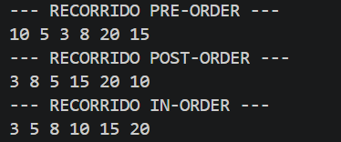
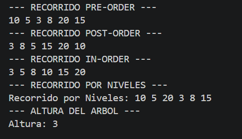
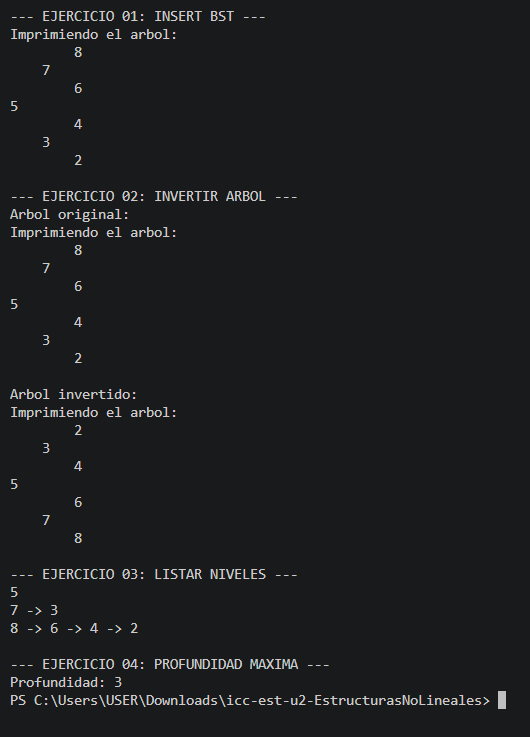

# Estructuras de Datos – Ejercicios con Arboles Binarios

## Practica: Arboles

## Estudiante: Sebastian Arenillas

## Grupo: 3

 Fecha: 17/06/2026

### 1. IntTree

Fecha: 16/06/2026

Descripcion: Se realizo un arbol con nodos enteros, ademas de los metodos preorder, posorder, inorder y calcular la altura.

### 2. BinaryTree

Fecha: 17/06/26 

Descripcion: Se creo la clase de BinaryTree y Person. Se creo un arbol que guarda objetos tipo Personas. En el BinaryTree se hizo que sean datos tipo genericos ademas de implementar validaciones para comparar las Personas por edad y si tienen la misma edad entonces por nombre.

Fecha: 23/06/26

Descripcion: Realizamos 4 ejercicios sobre arboles y documentamos todo el avance en un informe.